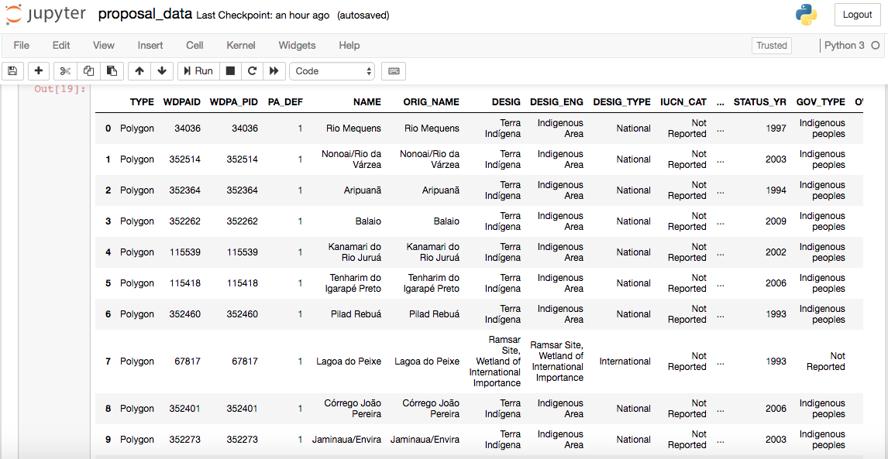
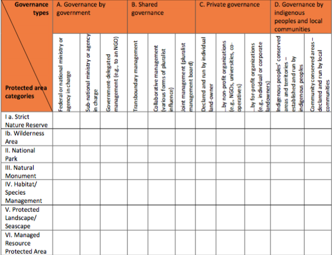
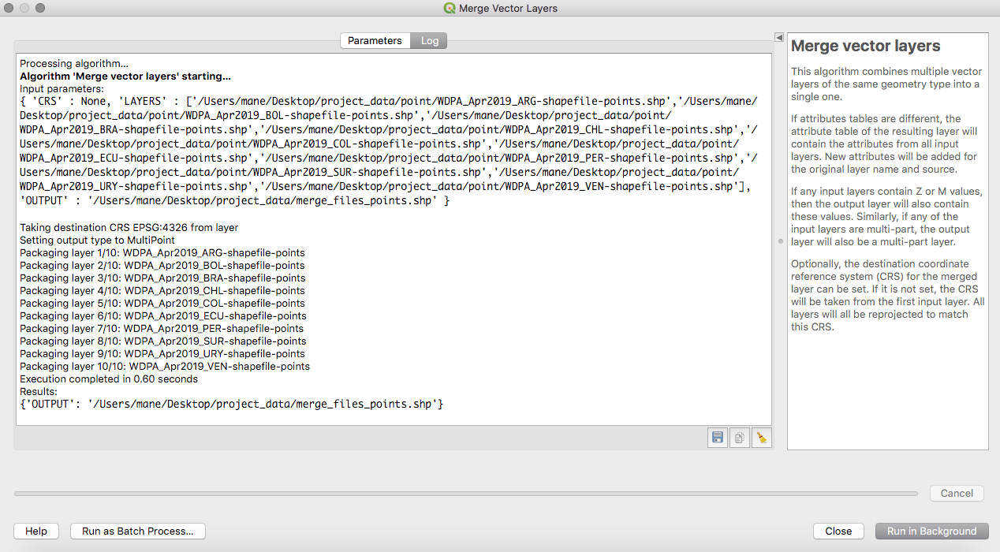
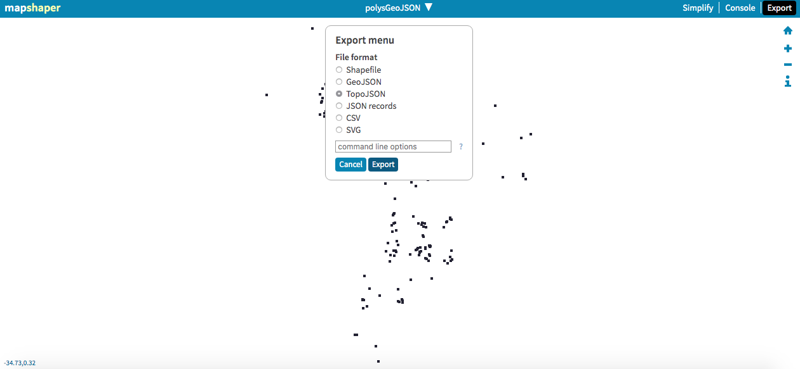
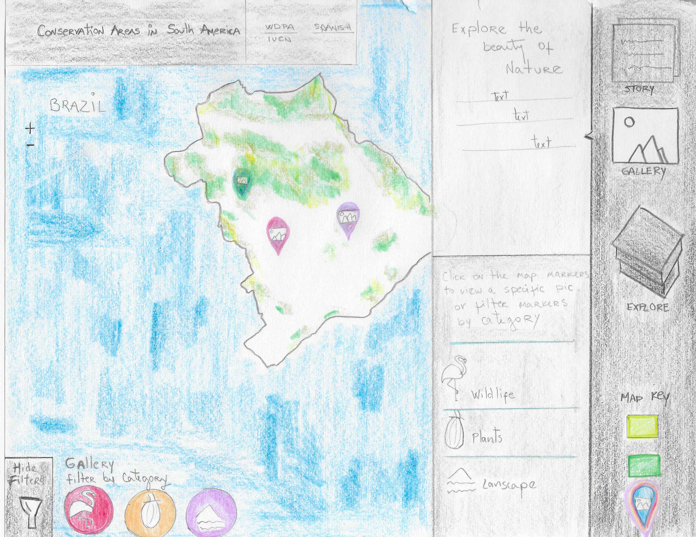

# [Conservation Areas in South America](https://www.protectedplanet.net)

### I. Introduction

The protected areas of South America (and the world) are the most valuable places for in situ conservation (Elbers, J).  Accounting 34% of the world’s plant species and 27% of mammals it is one of the most world’s biodiversity ‘superpowers’ [World Bank Organization](worldbank.org). The preservation of these treasure lands are very important due to the evident menace of man and its economic activities in the XXI century (Elbers, J). The map should appeal to all of us since the gradual destruction of our ecosystems and natural habitats have caused an imbalance in the biodiversity. Therefore, with this map I want to help create awareness about nature conservation since it relies on us “humans” to prevent the damage caused to the world by other humans (Jacob, S).

### II. Methodology

The data for this project will be obtained from the [World Database on Protected Areas](https://www.protectedplanet.net) (WDPA). The data will be processed using javascript, node, phython and/or other programming languages. The deliverable product will be a browser based interactive map. 

#### A. Data

The data will be obtained from the [World Database on Protected Areas](https://www.protectedplanet.net) (WDPA). The data processing and visualization for this project will included some JavaScript libraries like [D3js](https://d3js.org), [CartoDB](https://carto.com), [QGIS](https://qgis.org) as well the use of [Phython/Jupyter Notebooks](https://pypi.org) and [Pandas](https://pandas.pydata.org). 

The data for this project will be transformed into GeoJSON and/or Topojson files as the raw format currently are shapefiles and CSV format. The structure of this project is a story map with information relevant to the conservation areas of each country. The map will also contain photographs of The United Nations Educational, Scientific and Cultural Organization - Man and the Biosphere Programme [UNESCO-MAB] (http://www.unesco.org/new/en/natural-sciences/environment/ecological-sciences/).


*Example of Data*



*Data Categorization*

#### A.1 Data Processing 

South America contains 13 countries in its territory. The WDPA stores shapefiles by country for both polygons and points. Using the merge vector layers in QGIS a single shapefile of data was created. This method produced one single shapefile containing polygons of 13 countries and one single shapefile containing points of 10 countries. 

After merging the data mapshaper was used for commands to simplify, convert the file into a json file, and filter-fields. Finally, in order to reduce the file sizes mapshaper was used to convert GeoJson files to Topojson files. 

The following commands using mapshaper and ogr2ogr was used in order to created centroids of UNESCO-MAB Biosphere Reserve:

```mapshaper polygons.json -o format=shapefile polygons.shp```

```ogr2ogr -f GeoJSON polygon_designation.json polygons.shp -sql "select * from polygons where DESIG_ENG in ('UNESCO-MAB Biosphere Reserve')"```

The basemap was created using ```Mapbox studio``` and the icons display in the map were created with ```Adobe Illustrator.``` 


*QGIS Merge Vector Layers*


*Mapshaper tool -info*


*Mapshaper tool -filter-fields*


*Mapshaper.org to convert file to topojson*

#### B. Medium for delivery

The map will be a web browser-based application accessible to desktop devices. In order to have the best interaction for the user, the map will not be accessible across mobile devices. The JavaScript (JS) frameworks likely to be used are [HTML](https://www.quackit.com/html/codes/html_code_library.cfm), [SVG](https://svgjs.com/docs/2.7/), [CSS](https://www.quackit.com/css/), [Leaflet](https://leafletjs.com), [Vue.js](https://vuejs.org), [jQuery](https://api.jquery.com), [Bootstrap](https://getbootstrap.com/docs/4.3/getting-started/introduction/), [Assembly.css](https://labs.mapbox.com/assembly/) and others. 

#### C. Application layout

[Map Application Layout Mockup](pics/application_layout_mockup.pdf)

#### D. Thematic representation

The data in this project will be visually represented by polygons and points. The map will included icons for points. The polygon areas will be shown in the map using different hues to encode nominal distinctions/classification of protected areas. 

#### E. User interaction

This map is based on user interface and visualization. It will have different UI elements like checkboxes, toggle and simple buttons, designed icons, tool tips, pop-up windows, bars, pan/zoom, hover and click on features to retrieve information. 


*User Interaction Mockup*

#### F. Aesthetics and design considerations


*Aesthetics and Design Mockup*

#### G. Conclusion

Protected areas are the single most important conservation strategy in the world, and South America has the most land within protected areas of any region of the world (Leisher , C). They are undoubtedly one of the most important tools for the long-term conservation of nature, nevertheless, more needs to be done to support their effective operation. With the [World Database on Protected Areas](https://www.protectedplanet.net) (WDPA) and its joint effort between the [International Union for Conservation of Nature](https://www.iucn.org) (IUCN) and the [United Nations Environment Programme](https://www.unep-wcmc.org) (UNEP) to compile protected area information for all countries in the world it is possible to use these files in order to make an interactive map through the use of design and data visualization. Thus, the purpose of this map is to create awareness about the importance of nature conservation in the world.

### References

1. The protected areas of Latin America - current situation and prospects for the future. 2011. Elbers, J. 
2. The World Bank website.
3. 5 Major Reasons for Conserving Nature. 2017. Jacob, S.
4. Are Latin America's Protected Areas Effective at Conserving Nature? 2013. Leisher, C. 


