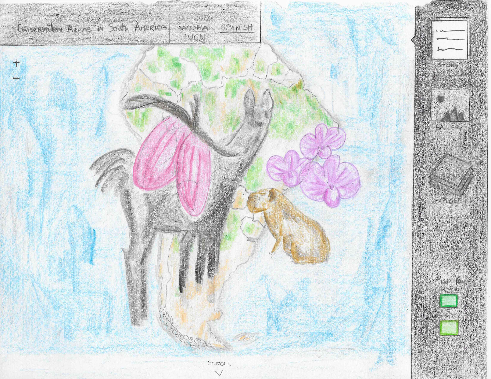

# [Conservation Areas in South America](https://geo.gob.bo/geonetwork/srv/eng/catalog.search#/metadata/46bb6940-2f29-40bd-a330-64edd523a3e9)

### I. Introduction

The protected areas of South America (and the world) are the most valuable places for in situ conservation (Elbers, J).  Accounting 34% of the world’s plant species and 27% of mammals it is one of the most world’s biodiversity ‘superpowers’ (worldbank.org). The preservation of these treasure lands are very important due to the evident menace of man and its economic activities in the XXI century (Elbers, J). The map should appeal to all of us since the gradual destruction of our ecosystems and natural habitats have caused an imbalance in the biodiversity. Therefore, with this map I want to help create awareness about nature conservation since it relies on us “humans” to prevent the damage caused to the world by other humans (Jacob, S).

### II. Methodology

The data for this project will be obtained from the World Database on Protected Areas (WDPA). The data will be processed using javascript, node, phython and/or other programming languages. The deliverable product will be a browser based interactive map. 

#### A. Data

The data will be obtained from the World Database on Protected Areas (WDPA) (GET LINK ON WDPA). The data processing and visualization for this project will included some JavaScript libraries like D3js, CartoDB as well the use of Phython/Jupyter Notebooks and Pandas. 
The data for this project will be transformed into GeoJSON files as the raw format currently are shapefiles. The structure of this project is a story map with information relevant to the conservation areas of each country. The map will also contain some pictures of its most representative species of wildlife, plants and/or landscapes.

#### B. Medium for delivery

The map will be a web browser-based application accessible to desktop devices. In order to have the best interaction for the user, the map will not be able to be enjoyed across mobile devices. The JavaScript (JS) frameworks likely to be used are HTML, SVG, CSS, Leaflet, Vue.js, jQuery, Bootstrap, Assembly.css and others. 
LINK TO THE LIBRARIES

#### C. Application layout

#### D. Thematic representation

The data in this project will be visually represented by polygons and points. The map will included icons for points and the polygon areas will be shown in the map using different hues to encode nominal distinctions/classification of protected areas. 

#### E. User interaction

This map is based on user interface and visualization. It will have several UI elements like checkboxes, toggle and simple buttons, designed icons, tool tips, pop-up windows, bars, pan/zoom, hover and click on features to retrieve information. 

#### F. Aesthetics and design considerations

#### G. Conclusion

Protected areas are the single most important conservation strategy in the world, and South America has the most land within protected areas of any region of the world (Leisher , C). They are undoubtedly one of the most important tools for the long-term conservation of nature, nevertheless, more needs to be done to support their effective operation. 
With the World Database on Protected Areas (WDPA) and its joint effort between the International Union for Conservation of Nature (IUCN) and the United Nations Environment Programme (UNEP) to compile protected area information for all countries in the world it is possible to use these files in order to make an interactive map through the use of design and data visualization. Thus, the purpose of this map is to create awareness about the importance of nature conservation in the world.

### References

1. The protected areas of Latin America - current situation and prospects for the future. 2011. Elbers, J. 
2. The World Bank website.
3. 5 Major Reasons for Conserving Nature. 2017. Jacob, S.
4. Are Latin America's Protected Areas Effective at Conserving Nature? 2013. Leisher, C. 